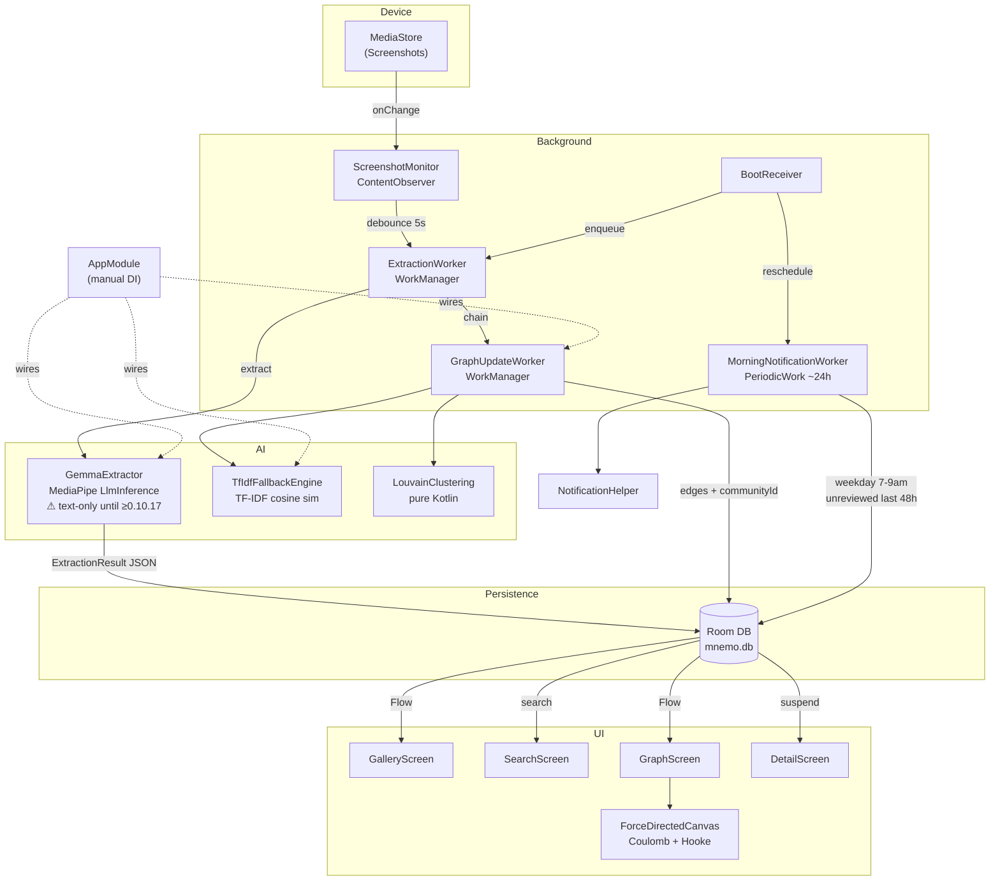

# Architecture

```mermaid
graph TD
  subgraph Device
      MediaStore["MediaStore\n(Screenshots)"]
  end

  subgraph Background
      Monitor["ScreenshotMonitor\nContentObserver"]
      ExW["ExtractionWorker\nWorkManager"]
      GraphW["GraphUpdateWorker\nWorkManager"]
      NotifW["MorningNotificationWorker\nPeriodicWork ~24h"]
      Boot["BootReceiver"]
  end

  subgraph AI
      Gemma["GemmaExtractor\nMediaPipe LlmInference\n⚠ text-only until ≥0.10.17"]
      TfIdf["TfIdfFallbackEngine\nTF-IDF cosine sim"]
      Louvain["LouvainClustering\npure Kotlin"]
  end

  subgraph Persistence
      DB[("Room DB\nmnemo.db")]
  end

  subgraph UI
      GalleryScreen
      SearchScreen
      GraphScreen --> ForceDir["ForceDirectedCanvas\nCoulomb + Hooke"]
      DetailScreen
  end

  MediaStore -->|onChange| Monitor
  Monitor -->|debounce 5s| ExW
  Boot -->|reschedule| NotifW
  Boot -->|enqueue| ExW

  ExW -->|extract| Gemma
  Gemma -->|ExtractionResult JSON| DB
  ExW -->|chain| GraphW
  GraphW --> TfIdf
  GraphW --> Louvain
  GraphW -->|edges + communityId| DB

  NotifW -->|"weekday 7-9am\nunreviewed last 48h"| DB
  NotifW --> NotifHelper["NotificationHelper"]

  DB -->|Flow| GalleryScreen
  DB -->|Flow| GraphScreen
  DB -->|search| SearchScreen
  DB -->|suspend| DetailScreen

  AppModule["AppModule\n(manual DI)"] -.->|wires| Gemma
  AppModule -.->|wires| TfIdf
  AppModule -.->|wires| GraphW
```
